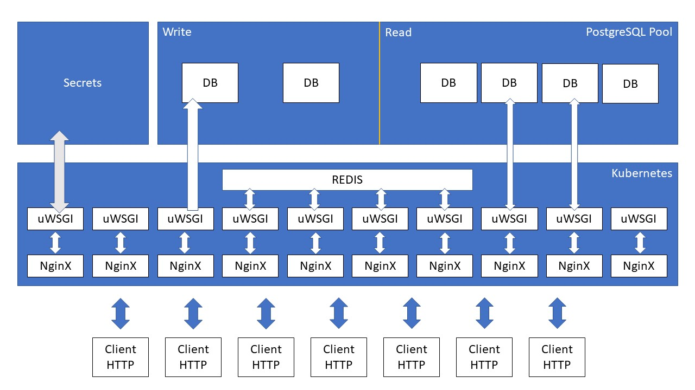

# PROPOSAL FOR TEST

## Models

Create model for traffic violations and notifications.

## API

The API should generate its documentation automatically based on the source code `(OpenAPI V3 standard)`.

`Uploading a traffic` violation is equivalent to `creating a resource (status code 201)` within the REST standard.

JSON responses must adhere to the `JSON standard (camelCase)` so I added the [djangorestframework-camel-case](https://github.com/vbabiy/djangorestframework-camel-case) library.

Improve data serialization using the [drf_ujson2](https://github.com/Amertz08/drf_ujson2) library (UltraJSON is used in FastAPI).

Authentication with the `JSON Web Token standard` is very popular, but for data access security a customization `must be done to verify the user's permissions (within the JWT) in the database`.

The traffic violation report requested for the API is not correctly structured, this is the same as consulting a list of resources; the correct thing would be a filter within the traffic violations resource, which receives an identifier such as the ID or a unique parameter such as the user's email.

## Project

`I added docker compose definitions so that you can build the necessary images to build the project` in the environments of: development, staging and production.

Here I have created some Docker images that are useful for the local development of python functions in the Service: Google Cloud Functions (Serverless):

- GitHub: https://github.com/hugofer93/gcp-cloud-functions-python

- DockerHub: https://hub.docker.com/r/hugofer93/gcp-cloud-functions-python

`The definition of dependencies for Python projects / libraries` is deprecating the use of .python-version and requirements.txt files. In its place the `pyproject.toml file was proposed` (see more in [PEP518](https://peps.python.org/pep-0518/) and [PEP517](https://peps.python.org/pep-0517/))

[Poetry](https://python-poetry.org/) utility allows to create virtual environment and manage project dependencies (using `pyproject.toml` file) without mixing development dependencies and main dependencies.

`Environment variables separate the configuration` of the execution environments without modifying the source code,but for more `sensitive data such as username, password, tokens it is recommended to use Secrets` so that the containers do not save this data.

## Improvements

Add tests in the functionalities, I did not add tests, due to lack of time for this, I reused all the functional code of Django and Django REST, both in views, serializers, models, managers, and more.

Here I have a repository of an integrated tests project for a library (Django App), I use [pytest-django](https://github.com/pytest-dev/pytest-django): [GitHub Repository](https://github.com/hugofer93/django-ec-idcardfield/tree/devel)

Use Redis to cache responses generated by views (Django) and shorten response time, reduce latency.

## AWS Deployment

`A Kubernetes cluster` (`using EC2 or AWS EKS instances`) is needed to build the PODS with the necessary containers.

Kubertes also provides a load balancer for the services we run on demand.

Receiving and sending HTTP responses requires `NginX as a reverse proxy` for Python containers.

To run the Django web app we need Gunicorn or `uWSGI` (better if it is uWSGI because it `has better performance and more configuration parameters`).

It is recommended to have a `PostgreSQL pool` to better manage writes and reads to the distributed database, `Amazon RDS` could be used to have the instances.

